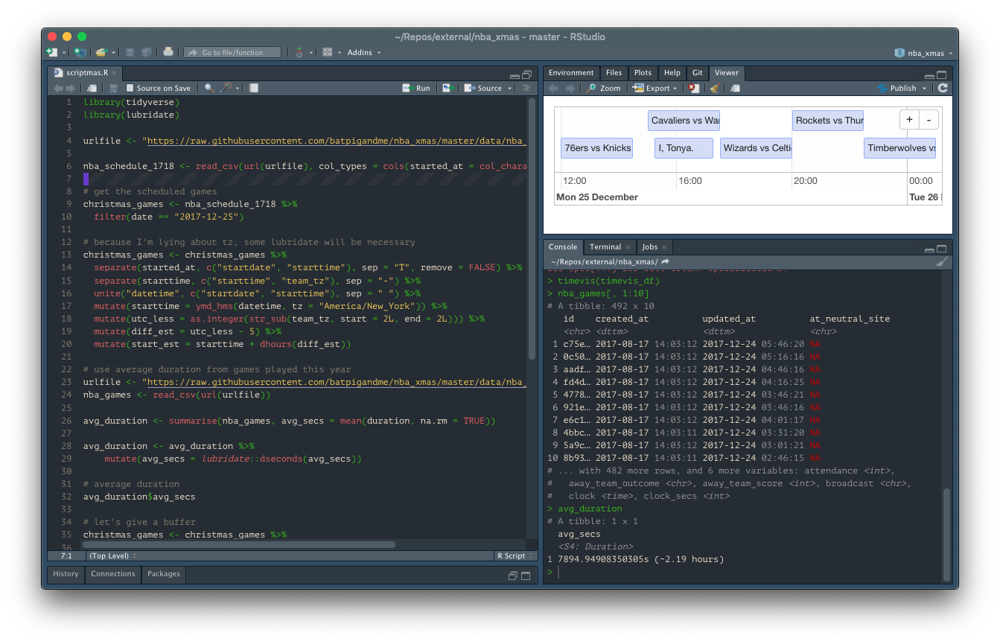
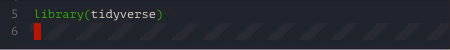

# Yule RStudio &#x2603;&#xFE0F; &#x1F384; &#x1F381;

### A Holiday Theme for RStudio

## &#x1F385; &#x1F936; 'Tis the season to be jolly!

Bring yuletide cheer and seasons greetings to your [favorite R IDE](https://rstudio.com). Based on the [Yule tmTheme](https://tmtheme-editor.herokuapp.com/#!/editor/theme/Yule) and modified to fit in well with RStudio Dark Mode. It's surprisingly pleasant and merrily festive!

Featuring magical additions such as a candy cane style line highlight and a blinking Christmas-light (vim) cursor:

## Installation

You'll need RStudio version 1.2. Grab the [preview version here](https://www.rstudio.com/products/rstudio/download/preview/).

1. Download [Yule-RStudio.rstheme](Yule-RStudio.rstheme) and place it in `~/.R/rstudio/themes`. 

2. In the RStudio appearance settings, select the _Yule RStudio_ editor theme. 

3. &#x2615; Make a cup of hot coco,

    &#x1F4FB; turn on [SomaFM's Christmas Lounge](https://somafm.com/christmas/), 
    
    &#x1F4BB; and enjoy coding by the open fire.
